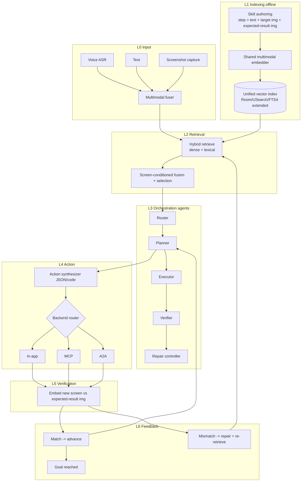
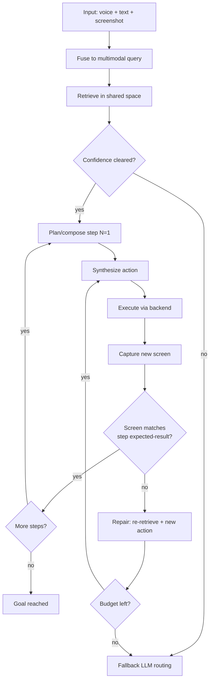
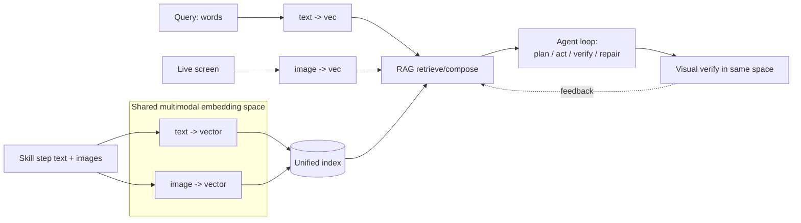
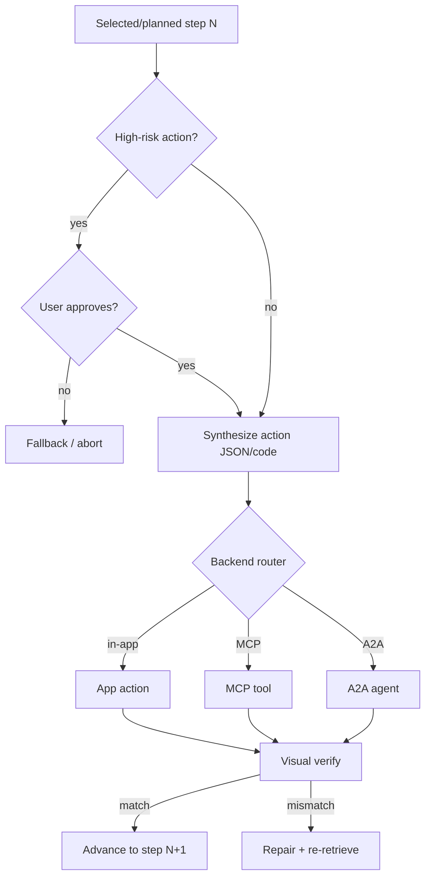
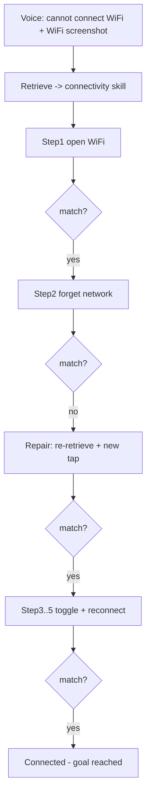
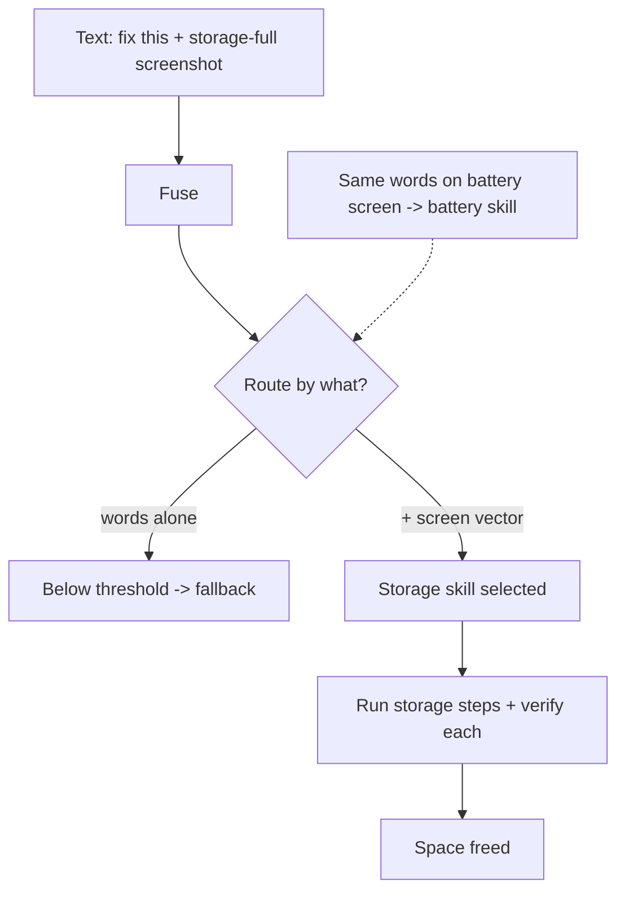
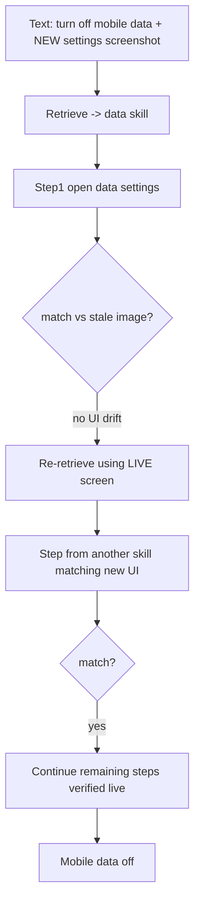
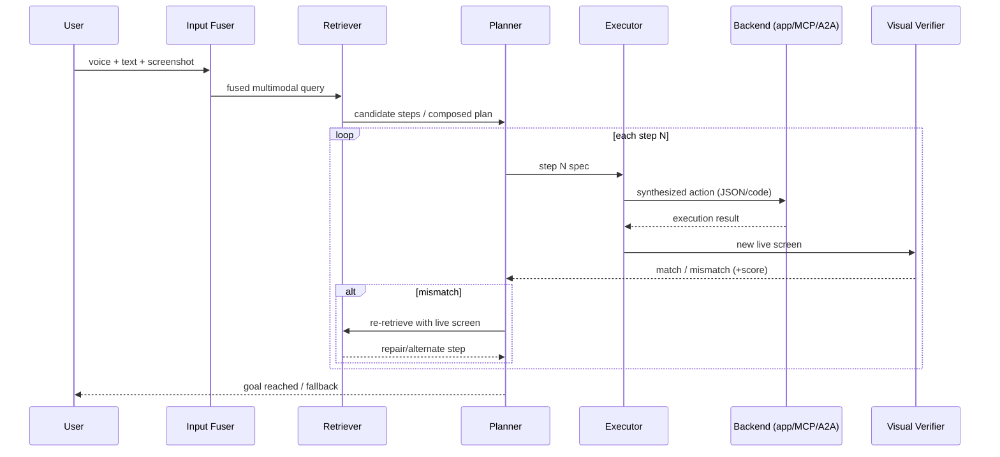
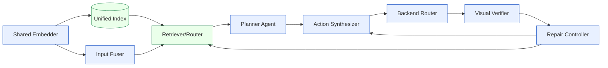

# Invention Disclosure Document (Internal)

> **Status:** Draft for internal review (patent committee / Renju / Sharmila Mani).
> **Classification target:** GUI-automation + computer-vision + multimodal information retrieval (see §14).
> **Prepared for:** Knox AI team, SRI-B.
> **Note on scope:** Several elements rest on architectural direction given verbally and on the uploaded "Dynamic Skill" Confluence flow. Every such element is marked **[ASSUMPTION]** or listed in §15. Nothing here is a final legal claim.

---

## 1. Proposed Invention Title

**Primary title:**
*On-Device Multimodal Skill Agent with Execution-Grounded Retrieval and Per-Step Visual Verification*

**Alternate / codename:**
*VESPER — Visually-verified, Execution-grounded Skill Procedure Execution & Retrieval*

**One-line descriptor:**
An on-device agent that retrieves and **composes** a multi-step skill from a shared text+image vector space, **executes it one step at a time**, **verifies each step against the live device screen**, and on visual failure **re-retrieves and repairs** — so that retrieval relevance is grounded in real on-device visual execution outcomes rather than fixed at query time.

---

## 2. Executive Summary

Existing on-device skill-routing (the current "Dynamic Skill" RAG) takes a **text query**, performs hybrid retrieval over **text-only `SKILL.md` chunks**, and **selects one skill** for the LLM/SLM to execute in a single shot. It has three structural blind spots: (a) it ignores the **live screen**, which is often the only real disambiguator; (b) it **discards visual content** embedded inside skill documents; and (c) it **never checks whether execution actually worked** — there is no feedback from action outcome back into retrieval.

This invention restructures the system into a **closed multimodal loop**:

1. **Multimodal input** (voice + text + a screenshot of the current screen) is fused into a single query.
2. A **shared text+image embedding space** indexes skills at **step granularity**, where each step carries an instruction, a target image, and an **expected-result image**.
3. Retrieval selects/composes a procedure; an **orchestration agent** executes it step-by-step across heterogeneous backends (**in-app action / MCP tool / A2A agent**) using **dynamically synthesized actions** (JSON/code).
4. After each step, a **visual verifier** embeds the new live screen and compares it to that step's expected-result image.
5. On mismatch, the system does **two** things together: **synthesizes a corrected action** and **re-retrieves the next step using the current screen** — fusing the execution loop and the retrieval loop.

**The defensible novelty** is item 5: *retrieval is driven by per-step on-device visual execution feedback, at step granularity*. This is different from ordinary RAG (retrieve once, no feedback), agentic/corrective RAG (text-relevance feedback), and GUI agents (screen-checking without retrieval re-grounding from an authored visual success-condition).

---

## 3. Current System / Existing RAG Flow

Source of truth: uploaded "Dynamic Skill" Confluence pages (Phases 1–3, §3.2 data flow, §7 walkthrough, §8 formulas).

**Indexing (runs once):**
`SKILL.md` files → **Chunking** (~2048 chars, section boundaries) → **Embedding** (768-dim, L2-normalized) → **Storage**: Room DB (`skill_chunk`), USearch (HNSW index), FTS4 (`skill_chunk_fts`).

**Retrieval (per query):**
User query (text) → **Normalization** (strip prefixes, remove punctuation) → parallel **Vector Search** (HNSW, M=16, efSearch=50, top-20) + **BM25 Search** (FTS4) → **RRF Fusion** (`1/(60+vRank)+1/(60+bRank)`, k=60) → 20 ScoredSkillChunks.

**Selection (per query):**
**Section Boost** (+20%/match, max +100%) → **Disambiguation** (−30% to −40% context penalty) → **Aggregation** (group by `skill_path`, SUM) → **Selection** (`score > 0.02`?) → **Yes:** return skill, inject routing JSON, LLM/SLM executes; **No:** fallback LLM routing.

**Key parameters (current):** embedding 768-d; HNSW M=16, efSearch=50; RRF k=60; section boost cap +100%; disambiguation −30/−40%; selection threshold 0.02.

**[ASSUMPTION A0]** Runtime is Android on-device (inferred from Room DB + USearch + FTS4 + Knox context). Embedder is an on-device ONNX model (diagram states only "768-dim, L2-normalized").

---

## 4. Problem and Limitations in the Current System

| # | Limitation | Consequence |
|---|---|---|
| L1 | **Text-only query.** The live screen — usually the real disambiguator — is never used. | Vague queries ("it's not working", "fix this") spread score thinly and fall below the 0.02 threshold → fallback. Correct skill not picked. |
| L2 | **Visual content in skills is discarded.** Chunking keeps text only; embedded diagrams/screenshots/tables-as-images are dropped at index time. | A skill whose key steps live in an image becomes under-represented and loses selection. The loss is invisible at query time. |
| L3 | **Single-shot, no execution feedback.** The skill is picked once; the system never learns whether the action worked. | If the picked skill is wrong, or a step fails, there is no recovery and no re-retrieval. |
| L4 | **Whole-skill granularity.** Retrieval returns one whole skill; it cannot assemble a procedure from parts. | Cannot handle goals that span multiple skills, or repair a single failing step from another skill. |
| L5 | **No per-step grounding before action.** Selection checks a scalar threshold, not whether the chosen skill fits the current screen. | Confidently-wrong skills execute, taking incorrect actions on the device. |
| L6 | **UI/version drift unhandled.** Static retrieval assumes the app UI matches the authored skill. | When the real UI differs from the authored screenshots, execution breaks with no adaptation. |

---

## 5. Proposed Invention and Key Novelty

**The invention** converts the single-shot text RAG into a **closed, multimodal, execution-grounded loop** with four structural changes and one novel core.

**Structural changes**
- **C1 — Multimodal input fusion:** voice→text + text + **screenshot-of-state**, fused into one query.
- **C2 — Shared text+image embedding space (Version 2):** one model embeds both text and images into a single vector space; a text query natively retrieves image steps. *(Chosen because shared-space on-device models exist — e.g. MobileCLIP2, SigLIP-2 — so a separate visual index is unnecessary.)* **[ASSUMPTION A1]** target embedder runs within on-device latency/battery budget.
- **C3 — Step-granular, multimodal skills:** each skill step = `{instruction text, target image, expected-result image}`; index granularity is the step.
- **C4 — Heterogeneous, dynamically-synthesized actions:** per step, an action (JSON/code) is generated and dispatched to **in-app action / MCP tool / A2A agent**.

**★ Key novelty (the core claim sits here)**
- **N1 — Per-step visual success-condition** *authored into the skill step* and verified by **embedding-similarity** between the live screen and the step's expected-result image.
- **N2 — Execution-grounded retrieval:** on visual mismatch, the system **re-retrieves the next/repair step using the current live screen** — i.e., *retrieval relevance is determined by on-device visual execution outcome*, not by query-time similarity alone.
- **N3 — Mismatch-driven action repair:** on mismatch, a **different** action is synthesized (not a blind retry), informed by the visual delta.
- **N4 — On-device step composition (dynamic skills):** the executed procedure is **assembled** from independently verifiable step primitives, possibly drawn from multiple skills; it need not equal any single authored skill.

**Why this is novel in combination:** ordinary RAG retrieves once with no feedback; corrective/agentic RAG feeds back **text** relevance; GUI/computer-use agents verify screens but without **authored per-step visual success-conditions driving retrieval re-grounding at step granularity, on-device.** The fusion of N1–N4 is the inventive step.

---

## 6. Detailed End-to-End Architecture

**Layered view**

- **L0 Input layer** — Voice ASR, text intake, screen capture; multimodal fusion → query embedding.
- **L1 Indexing layer (offline)** — Skill authoring (step = text + target img + expected-result img) → shared multimodal embedder → unified vector index (reusing Room/USearch/FTS4 structure, extended schema).
- **L2 Retrieval layer** — Shared-space search; hybrid dense+lexical; screen-conditioned fusion; selection/threshold.
- **L3 Orchestration layer (agents)** — Router → Planner → Executor → Verifier → Repair controller; payload between agents = **live visual state + step outcomes**.
- **L4 Action layer** — Per-step action synthesis (JSON/code) → backend router → in-app / MCP / A2A execution.
- **L5 Verification layer** — Embed new live screen; compare to step's expected-result image; pass/fail.
- **L6 Feedback layer (★)** — On fail: action repair **and** retrieval re-grounding; on pass: advance; on goal: end.

**Reuse vs new**

| Reuse (from current RAG) | Swap | Build new |
|---|---|---|
| HNSW/USearch index, hybrid retrieval, RRF idea, section boost, threshold/selection, fallback path | text-only 768-d embedder → **shared multimodal embedder**; whole-skill chunk → **step-level chunk** | shared-space indexer, step format with expected-result image, multimodal input fusion, per-step visual verifier, action synthesizer, backend router (in-app/MCP/A2A), orchestration agents, **execution-grounded re-retrieval loop** |

---

## 7. Component-wise Explanation

| Component | Purpose | Input | Output | Method / tech | Assumptions |
|---|---|---|---|---|---|
| **Multimodal Input Fuser** | Build one query from voice+text+screen | audio, text, screenshot | fused query vector + raw screen | ASR; shared-space embedding of text and screenshot | [A2] screenshot reachable at routing time |
| **Skill Indexer (VAAC)** | Make step text + step images retrievable | authored skills | unified vector index entries (`chunk_type=step`) | shared text+image embedder; per-step records bound to `skill_path` | [A3] skills authored with step images + expected-result images |
| **Shared Multimodal Embedder** | One vector space for text & images | text or image | dense vector | MobileCLIP2 / SigLIP-2 (ONNX, quantized) | [A1] on-device budget |
| **Retriever / Router (SSQE)** | Pick/compose procedure; screen-condition the pick | fused query, index | candidate steps/skill | dense + lexical hybrid; screen-conditioned fusion; threshold | tie-break rule [A] |
| **Planner Agent** | Order/compose steps toward goal | candidate steps, goal, screen | step N spec | agentic planning over verifiable step primitives | — |
| **Action Synthesizer** | Turn step N into a concrete action | step N spec, screen | action (JSON/code) | template-fill or code-gen **[OPEN: which — see §15]** | — |
| **Backend Router** | Dispatch to the right executor | action | execution result | adapters for in-app / MCP / A2A | [A4] MCP/A2A availability |
| **Visual Verifier (VGG, per-step)** | Confirm step succeeded | new live screen, step expected-result image | match / mismatch + score | embedding-similarity in shared space; threshold τ | detector reliability |
| **Repair Controller (★)** | Recover from visual failure | mismatch, screen, history | corrected action **and** re-retrieval trigger | synthesize different action; re-query retriever with live screen | — |
| **Fallback** | Safe exit | no-match / low-confidence | hand to plain LLM routing | reuse current fallback edge | — |

---

## 8. Detailed Numbered Technical Workflow (input → final action)

1. **Receive input** in any mix: voice, text, screenshot of current screen.
2. **Transcribe** voice → text (if present).
3. **Capture/normalize** the screenshot as the current **screen-state** image.
4. **Fuse** text + screen-state into a single query representation in the shared embedding space.
5. **Retrieve** candidate steps/skills from the unified index (dense + lexical), with the **live screen conditioning** the ranking.
6. **Select / compose:** if a single skill dominates, pick it; otherwise the **Planner** composes a step-set toward the goal. If nothing clears the confidence threshold → **fallback**.
7. **Initialize** step pointer N = 1.
8. **Synthesize action** for step N (JSON/code) from the step spec + current screen.
9. **Route** the action to its backend (in-app / MCP / A2A) and **execute**.
10. **Capture the new live screen** after execution.
11. **Verify:** embed the new screen; compute similarity to step N's **expected-result image**.
12. **If match (≥ τ):** advance — N ← N+1; if more steps, go to 8; else go to 16.
13. **If mismatch (< τ):** enter **repair**:
    a. **Re-retrieve** using the current live screen as query → fetch a repair step or alternate step (execution-grounded retrieval).
    b. **Synthesize a different action** (not a blind retry), informed by the visual delta.
    c. Re-execute (go to 9). Apply a bounded retry/repair budget; if exhausted → **fallback** or escalate.
14. **(Optional) Approval gate:** for high-risk actions, require user confirmation before executing step N (see FIG. 4).
15. **(Loop)** continue until all steps verify or budget exhausts.
16. **Goal reached:** report success; persist outcome (optional) for future ranking.

---

## 9. Use Cases (with example data and decisions)

### Use Case 1 — Multimodal happy path with one repair (WiFi)
- **Input:** voice *"I can't connect to WiFi"* + screenshot = WiFi settings (failed connection).
- **Fusion:** text + screen-state → query vector.
- **Retrieval decision:** live WiFi screen reinforces the **connectivity** skill → selected (clears threshold).
- **Skill (5 steps):** open WiFi → forget network → toggle off → toggle on → reconnect; each step has an expected-result image.
- **Execution:**
  - Step 1 → action "open WiFi settings" → verify vs expected → **match**.
  - Step 2 "forget network" → execute → new screen still shows old network → **mismatch** → repair: re-retrieve with current screen + synthesize corrected tap → re-execute → **match**.
  - Steps 3–5 → execute → verify each → **match**.
- **Decision/outcome:** goal reached; the per-step repair fixed a failure a single-shot system would have missed.

### Use Case 2 — Screen disambiguates a vague query (storage)
- **Input:** text *"fix this"* + screenshot = storage-full warning. (No voice.)
- **Problem today:** words carry no routing signal → best skill < 0.02 → fallback.
- **Retrieval decision (invention):** the screenshot vector sits near **storage** step-images in the shared space → storage skill crosses the confidence threshold and is selected — *the screen, not the words, made the pick.*
- **Execution:** clear cache → delete temp → free space; verify each step; step 3 (cache clear) fails → repair regenerates the action → succeeds.
- **Counterfactual:** identical words *"fix this"* on a **battery-saver** screen would route to the **battery** skill. Same words, different screen, different correct skill.

### Use Case 3 — UI drift → execution-grounded re-retrieval + cross-skill composition (★ novelty)
- **Input:** text *"turn off mobile data to save data"* + screenshot = a **redesigned** Settings screen (app version updated; authored skill screenshots are stale).
- **Retrieval decision:** connectivity/data skill selected.
- **Execution:**
  - Step 1 "open data settings" → execute → verify vs **stale** expected image → **mismatch** (UI drifted).
  - **Repair / re-ground:** re-retrieve using the **current** live screen → the retriever surfaces a step (possibly from a *different* skill's step library) that matches the new UI → splice it in → execute → **match**.
  - Remaining steps verified against live screens.
- **Decision/outcome:** the procedure that actually ran was **composed at runtime** from steps across skills, adapting to UI drift — impossible for whole-skill, single-shot retrieval. This is the clearest demonstration of N2 + N4.

---

## 10. Novelty and Differentiators

| Capability | Normal RAG chatbot | OCR tool | Generic AI / GUI agent | **This invention** |
|---|---|---|---|---|
| Output | text answer | extracted text | actions | **verified multi-step device actions** |
| Uses live screen as input | No | No | Sometimes | **Yes — as query + per-step verifier** |
| Visual content in corpus | Dropped/needs OCR | Is the input | Varies | **Embedded directly (shared space), step-bound** |
| Retrieval feedback | None (one-shot) | N/A | Text re-planning at best | **On-device visual execution outcome drives re-retrieval** |
| Granularity | document/chunk | page | task | **step primitive (composable)** |
| Per-step success-condition | No | No | Usually learned/implicit | **Authored visual success-condition, similarity-verified** |
| Failure recovery | No | No | Retry/replan | **Mismatch-driven action repair + retrieval re-grounding** |
| Backends | text gen | none | one harness | **in-app / MCP / A2A, dynamically synthesized** |

**Plain statement of difference:** a normal RAG chatbot *answers*; an OCR tool *reads*; a GUI agent *acts and may re-plan on text*. **This system makes retrieval itself accountable to on-device visual execution outcomes at step granularity, using authored per-step visual success-conditions** — combining retrieval, vision, and action into one feedback loop none of the three has.

---

## 11. Patent Figure Plan

| FIG | Title | Shows | Type |
|---|---|---|---|
| **FIG. 1** | Overall system architecture | All layers L0–L6 as blocks; reuse vs new shading | Block diagram |
| **FIG. 2** | End-to-end flow | Input → retrieve → step loop → verify → repair/advance → done | Flowchart |
| **FIG. 3** | Vision + RAG + agent processing | Shared embedder feeding both indexing and query; agents around the loop | Data-flow diagram |
| **FIG. 4** | Approval & action execution | Selection → (optional approval gate) → action synthesis → backend router → execute → verify | Flowchart |
| **FIG. 5** | Use case 1 (WiFi, repair) | Concrete trace with one repair | Use-case flow |
| **FIG. 6** | Use case 2 (vague query, screen disambiguation) | Screen vs words routing | Use-case flow |
| **FIG. 7** | Use case 3 (UI drift, re-retrieval + composition) | Re-grounding + cross-skill splice | Use-case flow |
| **FIG. 8** | Sequence diagram | Time-ordered messages: User → Fuser → Retriever → Planner → Executor → Backend → Verifier → Repair | Sequence |
| **FIG. 9** | Component block diagram | Modules + interfaces (inputs/outputs) | Block diagram |

---

## 12. Mermaid Code for Every Required Diagram

### FIG. 1 — Overall architecture (block)

### FIG. 2 — End-to-end flow

### FIG. 3 — Vision + RAG + AI-agent processing

### FIG. 4 — Approval & action execution

### FIG. 5 — Use case 1 (WiFi, repair)

### FIG. 6 — Use case 2 (vague query, screen disambiguation)

### FIG. 7 — Use case 3 (UI drift, re-retrieval + composition)

### FIG. 8 — Sequence diagram

### FIG. 9 — Component block diagram

---

## 13. Text Instructions for Professional PNG / PPT Diagrams

**General**
- Canvas 1920×1080 (16:9) for PPT; export PNG at 2× (3840×2160) for patent-grade clarity.
- Palette: reuse = green (#2E8B57 stroke / #EAFFEA fill); new modules = blue (#3366CC / #E8F0FF); the **★ feedback loop** = red dashed arrows (#C0392B). Keep ≤3 colors + grey text.
- Font: a single sans-serif (e.g. Inter/Calibri), 18–24 pt node text, 28–32 pt titles. Number every figure "FIG. N".
- Arrows: solid = forward data flow; **dashed red = feedback/re-retrieval**; diamonds = decisions.

**Per figure**
- **FIG. 1:** five horizontal swimlanes (L0–L6). Put the unified index as a cylinder. Shade reuse-green vs new-blue. Draw the two red dashed return arrows (verify→planner advance, verify→retriever re-ground) prominently — they are the invention.
- **FIG. 2:** top-to-bottom; decisions as diamonds (confidence, match, budget). One clear red dashed "repair" return.
- **FIG. 3:** center the shared embedding space as one box feeding both indexing (left) and query (right); a single dashed "feedback" arrow from verifier back to RAG.
- **FIG. 4:** linear with an approval diamond; three backend branches collapsing into one verify node.
- **FIG. 5–7:** keep each on one slide; annotate the mismatch/repair node in red so reviewers see the differentiator.
- **FIG. 8:** standard UML sequence; emphasize the `alt mismatch` block with a shaded rectangle.
- **FIG. 9:** modules as boxes with labeled input/output ports; group reuse vs new with a dashed boundary.

**Toolchain options**
- Fastest: paste each Mermaid block into mermaid.live → export SVG → open in PowerPoint/Illustrator → recolor per palette → export PNG @2×.
- PPT-native: rebuild FIG. 1/9 as SmartArt/shapes for editability; keep FIG. 2/4/8 from Mermaid SVG.
- Maintain one master slide so all figures share fonts/colors.

---

## 14. High-Level Claim Concepts (not final legal claims)

**System concept (independent):** an on-device system comprising a shared text-image embedding index of skill **steps**, each step associated with a visual success-condition; a retriever that selects/composes steps from a fused query including a device screenshot; an executor that synthesizes and dispatches per-step actions to heterogeneous backends; a verifier that compares the post-action live screen to the step's visual success-condition; and a controller that, on a verification failure, **re-retrieves a subsequent step using the live screen and synthesizes a corrected action**.

**Method concept (independent):** capturing multimodal input including a device screen; retrieving/composing a multi-step procedure from a shared multimodal space; for each step, synthesizing and executing an action, then verifying the resulting live screen against an authored visual success-condition; and on mismatch, **re-retrieving using the live screen and synthesizing a different action**, thereby grounding retrieval in visual execution outcome.

**Dependent-claim directions:** screen-conditioned ranking that lifts a candidate above a selection threshold; step-level composition across multiple skills; graceful degradation to text-only when no screenshot is available; bounded repair/retry budget then fallback; optional approval gate for high-risk actions; backend selection among in-app/MCP/A2A; expected-result represented as an image embedding and verified by similarity threshold τ; integrity/version-drift handling via re-grounding.

*(Claim concepts are intentionally high-level; final claims to be drafted with patent counsel after the prior-art sweep in §15.)*

---

## 15. Assumptions, Open Questions, Items Requiring Confirmation

**Resolved during scoping**
- Shared text+image embedding space (**Version 2**) — confirmed feasible; on-device candidates exist (MobileCLIP2 / SigLIP-2, ONNX-quantized).

**Must confirm on the Knox build (blockers if false)**
- **[A2] Screenshot access at routing time** — can the agent obtain the current screen at `tryDynamicSkillRoute()` (permissions, timing)? *SSQE/VGG/the whole loop depend on this.*
- **[A3] Authoring** — will skills be authored with **step images + expected-result images**? Who authors them, in what format?
- **[A1] On-device budget** — does the chosen shared embedder meet latency/battery limits per turn (and per step, since verification runs every step)?

**Design forks (change novelty/build)**
- **Visual success-condition:** authored vs auto-derived. *Authored is the stronger, narrower novelty — recommended.*
- **Dynamic action:** generate **new code** vs **fill JSON templates**. (Different risk/novelty profiles.)
- **Backends:** are MCP and A2A near-term or aspirational? In-app is assumed the primary target.
- **Voice:** firm requirement or future? (Modular either way.)
- **Verification metric:** pure embedding similarity vs hybrid (similarity + element/region check) — affects robustness.

**Process / legal**
- **Inventorship** to be confirmed (contributors include K. Kalita; architectural direction from S. Mani; novelty coordination with Renju CNAIR) — inventorship is a legal determination, not assumed here.
- **Prior-art sweep required before drafting claims.** Suggested keyword clusters: "GUI agent screenshot step verification", "corrective / agentic RAG", "multimodal embedding retrieval RAG", "on-device skill routing", "UI automation precondition check", "expected screen state verification action", "retrieval re-ranking execution feedback". Classes to scan: G06F 9/451, G06V (incl. 30/40), G06F 16/532–538 & 16/55x, G06N, G06F 11/14, G06F 3/16.
- **Honest novelty posture:** broad framings (multimodal RAG, agentic RAG, GUI agent) are prior-art-dense; the fileable invention is the **specific combination N1–N4**, especially **execution-grounded re-retrieval driven by authored per-step visual success-conditions, on-device.**

---

## 16. Final Polished Internal Invention Disclosure (consolidated form)

| Field | Entry |
|---|---|
| **Title** | On-Device Multimodal Skill Agent with Execution-Grounded Retrieval and Per-Step Visual Verification (codename VESPER) |
| **Inventors** | K. Kalita; others **[to confirm]** (R. CNAIR; architectural direction S. Mani) |
| **Team / org** | Knox AI, SRI-B |
| **Field** | On-device agentic GUI automation; multimodal information retrieval; computer vision |
| **Problem** | Text-only single-shot skill RAG ignores the live screen, discards visual skill content, and never verifies execution — causing mis-routing, lost skills, wrong actions, and no recovery under UI drift. |
| **Solution** | A closed multimodal loop: fuse voice+text+screenshot; retrieve/compose **step-granular** skills from a **shared text+image space**; execute per-step actions across in-app/MCP/A2A; **verify each step against an authored visual success-condition**; on mismatch, **re-retrieve using the live screen and synthesize a corrected action**. |
| **Key novelty** | Retrieval relevance grounded in **on-device per-step visual execution outcome** (N2), via **authored visual success-conditions** (N1), with **mismatch-driven repair** (N3) and **runtime step composition** (N4). |
| **Differentiators** | Not a chatbot (acts), not OCR (verifies + retrieves), not a generic GUI agent (authored per-step visual goals drive retrieval re-grounding at step granularity, on-device). |
| **Primary effects** | Higher correct-routing on ambiguous queries; recovery from step failures and UI drift; reduced wrong-action execution; adaptive cross-skill procedures. |
| **Reused** | Hybrid retrieval, RRF, section boost, threshold/selection, fallback. |
| **New** | Shared embedder + step index, multimodal fuser, per-step visual verifier, action synthesizer, backend router, orchestration agents, execution-grounded re-retrieval loop. |
| **Figures** | FIG. 1–9 (architecture, flow, vision+RAG+agent, approval/exec, 3 use cases, sequence, components). |
| **Maturity** | Concept + architecture; prototyping pending confirmation of [A1]/[A2]/[A3]. |
| **Blockers / open** | Screenshot access; skill authoring with expected-result images; on-device embedder budget; action-synthesis approach; MCP/A2A scope; inventorship; prior-art sweep. |
| **Risk posture** | Fileable if claimed narrowly on N1–N4 combination; broad claims expected to face dense prior art. |
| **Next steps** | (1) Confirm blockers on Knox build; (2) prior-art sweep; (3) draft claims with counsel; (4) build minimal prototype of the verify→re-retrieve loop for evidence. |

---

*End of disclosure draft. All items marked [ASSUMPTION]/[A#]/[OPEN] require confirmation before external filing. Prior-art risk levels stated herein are internal hypotheses, not search results.*
